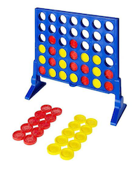

# Conecta 4


El clasico juego de mesa Conecta 4 llevado al gran mundo de los ASCII Games. Desde la terminal puedes jugar con un tablero del tamano que tu quieras, ya sea en formato Multiplayer contra otra persona o en Single Player contra una IA.


## Preparacion

Las siguientes instrucciones te permitiran preparar tu sistema para poder jugar al juego.

### Prerrequisitos

Para poder compilar el juego es necesario tener operativo el compilador del lenguaje Haskell GHC:

```
sudo apt-get update
sudo apt-get install ghc
```
Ademas tambien es necesario contar con una libreria para contar con numeros aleatorios:
```
sudo apt-get update
sudo apt install cabal-install
cabal update
cabal install random
```

### Instalacion

Para instalar el juego, simplemente debes situarte en la carpeta en la que se encuentra el fichero `joc.hs` y ejecutar los siguientes comandos:

Compilacion del juego. Puedes compilarlo con el nombre que quieras, en este caso yo he utilizado el nombre `conecta4`.

```
ghc joc.hs -o conecta4
```

El fichero generado es el ejecutable que contiene el juego. Puedes moverlo a la carpeta que tu quieras, y desde ahi, ejecutarlo.


## Ejecucion del Juego

Para ejecutar el juego, desde terminal, colocate en la carpeta en la que se encuentra el fichero ejecutable generado en el paso anterior y ejecuta el siguiente comando:
```
./conecta4
```

### Instrucciones una vez ejecutado el juego.

Una vez ejecutado el juego, este nos realizara diferentes preguntas para configurar la partida.

Debemos escoger el tipo de tablero:
 * `Tablero clasico`: tamano 6x7
 * `Tablero personalizado`: tu escoges altura y anchura del tablero

Debemos escoger el numero de jugadores:
 * `Single Player`: juegas tu contra la IA.
 * `Multi Player`: juegas contra otra persona, donde alternadamente ireis depositando las piezas en el tablero.

En el caso de haber escogido `Single Player`, este nos preguntara por el tipo de IA contra el que queremos jugar:
 * `RANDOM`: La IA introduce piezas de forma aleatoria.
 * `GREEDY`: La IA intenta conectar 4 a toda costa, y bloquea (si puede) que tu lo hagas en la siguiente ronda.
 *  `SMART`: La IA intenta generar estrucutras trampa, bloquea los ataque simples de doble hueco, no introduce ficha en las posiciones que te generen una victoria en un paso y si se encuentra perdido, aplica el algoritmo de minimax basado en el numero de lineas potenciales a generar (Para mas informacion, mira la seccion Algoritmos).

### Algunos ejemplos de configuracion


## Metodologia

### Representacion del Mundo
Lo que en el contexto del conecta 4 podemos denominar como mundo, se corresponde con el tablero de juego. Este tablero, lo podemos considerar un conjunto de celdas distribuidas en formato de matriz NxM que pueden o bien estar vacias, o bien estar ocupadas por una ficha de un jugador.

En mi caso, decidi representar el tablero como una estructura de 4 elementos:
```
data Board = Board
    {
        heigth  :: Int  ,
        width   :: Int  ,
        tops    :: [Int],
        cells   :: Map (Int, Int) Player
    }
```
* `heigth`: Numero de filas del tablero (altura).
* `width`:  Numero de columnas del tablero (anchura).
* `tops`: Vector de elementos que indica cual es la siguiente altura en la que se colocara una ficha concreta.
* `cells`:  Diccionario que guarda las celdas del tablero ocupadas por alguna ficha.

Con las variables `heigth` y `width` sabemos cuales son los limites en cuanto a coordenadas se refiere a la hora de hacer inserciones/consultas en el diccionario. Mediante consultas a `tops`, podemos saber,en una columna concreta, que posiciones estan ocupadas y que posiciones estan vacias, y por lo tanto, sin tener que consultar al diccionario, cuantas casillas estan ocuapadas, si el tablero esta lleno, etc. Finalmente `cells` es la estructura de datos que guarda la informacion esencial para saber donde esta colocada cada ficha, y todo lo que podemos deducir de ello: quien ha ganado, hay lineas, estrucutras formadas, etc.

Dado que este es un juego de dos jugadores, el concepto de jugador lo he representado simplemente con un caracter asociado a cada uno. He utilizado los clasicos `X` y `O` para ello:
```
data Player = X | O
```
Finalmente, como tambien contamos con la posibilidad de jugar contra una IA, esta ha sido definida segun sus 3 posibles valores mas un valor nulo para cuando esta no se utiliza (en el caso de jugar en modo multijugador).
```
data AI = RANDOM | GREEDY | SMART | NONE
```
Con estas estructuras de datos tenemos mas que suficiente para representar cada estado posible del tablero y acceder a su informacion de forma comoda y estructurada.

### Inteligencia Artificial
En este apartado se detallan los diferentes algoritmos implementados para cada uno de los niveles disponibles.

#### RANDOM
Esta implementacion esta basada simplemente en escoger de forma aleatoria una de las columnas disponibles y lanzar ficha. Podemos afirmar que no hay ningun tipo de inteligencia ni comportamiento complejo en este modo.

#### GREEDY
El modo de juego GREEDY tambien esta conformado por un algoritmo muy basico. El unico razonamiento aplicado a cada a tirada sigue este orden de preferencia:

  1) Si hay alguna columna en la que si pongo ficha conecto 4, pongo ficha en esa columna.
  2) Si hay alguna columna en la que si el oponente pone ficha conecta 4, pongo ficha en esa columna.
  3) Si hay alguna columna en la que si pongo ficha conecto 3, pongo ficha en esa columna.
  4) Si hay alguna columna en la que si pongo ficha conecto 2, pongo ficha en esa columna.
  5) Pongo ficha en una columna aleatoria.

Para comprobar cuantas fichas se conectan en cada tablero posible, creamos un tablero auxiliar resultante de anadirle una ficha en la columna correspondiente y hacemos uso de la siguiente funcion: 
```
some_line_of :: Player -> Int -> Board -> Bool    -- some_line_of P N B --> Bool
```
Esta busca en todas las direcciones del tablero `B`, un patron de `N` fichas de longitud del jugador `P`. Con una llamada adaptada a cada caso, podemos decidir facilmente donde lanzamos ficha.

#### SMART
Finalmente, llegamos a la implentacion mas compleja de las 3. Como su nombre indica, el objetivo no es otro que representar una actitud inteligente a la hora de jugar: Evitar caer en trampas obvias e intentar no generar lineas de 4 facilmente bloqueables, sino estructuras que si las intentas bloquear, pierdes, lo cual quiere decir, que si conseguimos generar la estructura, la victoria esta asegurada.

El algoritmo esta dividido en diferentes fases. Se realiza una inspeccion siguiendo una jerarquia de situaciones que queremos evitar/generar:

#### Fase Inicial
1. ##### Conseguir la ficha central
   Matematicamente esta demostrado que en el tablero clasico hay mas posibilidades de ganar si contamos con esta.

#### Fase Defensiva
2. ##### Intentar ganar en esta tirada:
   Poner ficha para conectar 4.

3. ##### Evitar perder en esta tirada y en la siguiente:
   Bloquear una linea de 3 que puede convertirse en una de 4 y no poner ficha en un lugar que immediatamente provoque la victoria del oponente. Para ellos simplemente comprobamos que al colocar nuestra ficha, si colocamos todas las fichas posibles del oponente, no se genere una linea de 4.

4. ##### Bloquear estructuras abiertas por dos lados: 
    Esta estructura consiste en generar una linea de dos fichas, acompanada de 3 huecos, de forma que en la siguiente tirada, no puedes bloquear ambos lados. Si el enemigo la consigue, no podremos bloquearle.
    
    

#### Fase de Ataque
5. ##### Generar Siete
    La estrategia del 7 consiste en dibujar con tus fichas una estructura con la forma del numero 7. Una vez construida, solo es necesario hacer crecer la columna paralela a la estructura por la derecha, para forzar al oponente que bloquee la linea horizontal, para posteriormente conectar 4 en diagonal.

    El algoritmo busca todos los puntos desde los que puede dibujar un 7, y por orden de distancia al mismo (entendiendo por distancia, el numero de fichas restantes necesarias para dibujarlo), intenta dibujar el que requiere menos movimientos.

    Ademas, el algoritmo cuenta con movimientos predisenados para provocar al humano colocar pieza alli donde el algoritmo necesita altura. Por ejemplo, como se puede apreciar en la siguiente imagen, coloca una ficha extra en la superior izquierda (columna D) para provocar al humano bloquear la diagonal hacia abajo y asi conseguir dibujar la diagonal del siete.

    
    

6. ##### Generar Siete Invertido
    La estrategia del siete invertido es exactamente igual que la anterior, pero la diagonal se genera hacia el otro lado. Es decir, dibuja el numero 7 como si estuviese reflejado en un espejo.
#### Fase Heuristica
8. ##### Minimax
    Finalmente, si el algoritmo no encuentra posiciones validas para comenzar a dibujar un 7, ya sea normal o invertido, y tampoco encuentra nada que bloquear, entonces aplica el clasico algoritmo de MiniMax con profundidad 4, para escoger una buena tirada. Si en profundidad 4 no se encuentra un nodo terminal (lo que en este caso se consideraria que uno de los dos ha hecho conecta 4) se calcula un heuristico que evalua ese estado del tablero en base al numero de lineas de cada longitud, de cada jugador que potencialmente podrian convertirse en una conexion de 4 o mas fichas.

## Herramientas utilizadas

* [Haskell](https://www.haskell.org/) - An advanced, purely functional programming language


## Authors

* **Edgar Perez Blanco** - *Full Project* - [GitHub](https://github.com/foster99)